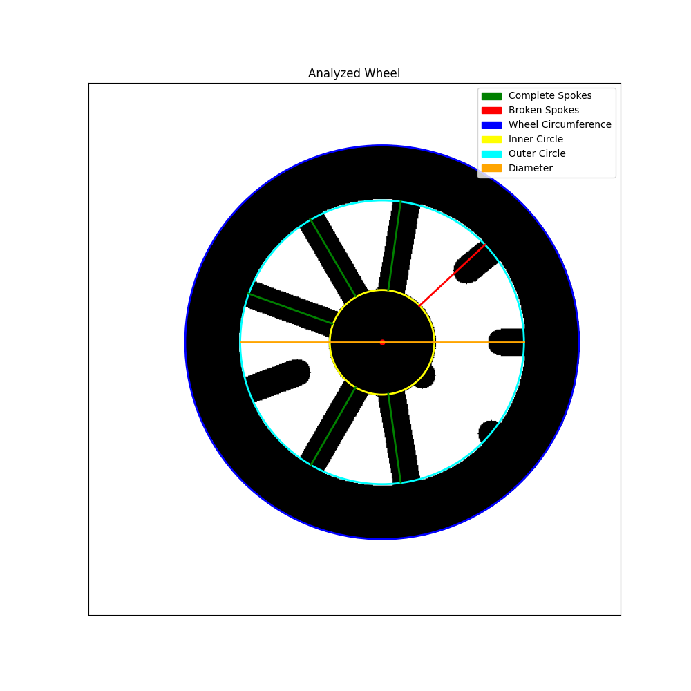
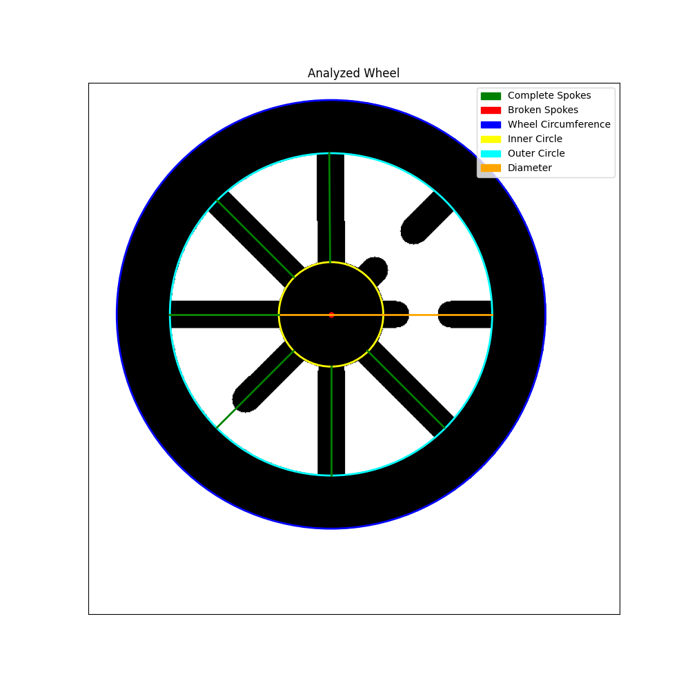
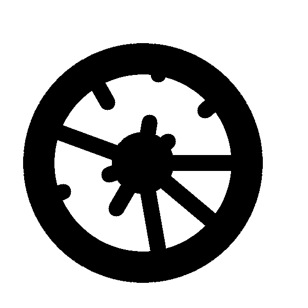

# Wheel Analysis Project

This project aims to analyze wooden wheel images to detect and count spokes, identifying both complete and broken 
spokes. It implements two different approaches: a Computer Vision (CV) method and a Large Language Model (LLM) based method.

## Project Structure
```
wheel_analysis_project
│ ├── data 
│ └── (original wheel images) 
│ ├── results 
│ └── (output images from CV approach) 
│ ├── debug 
│ └── (debug images from CV approach) 
│ ├── src 
│ ├── cv_analyzer.py 
│ └── llm_analyzer.py 
│ └── README.md
```

## Installation

1. Clone this repository:
`git clone https://github.com/your-username/wheel_analysis_project.git cd wheel_analysis_project`

2. Create a virtual environment and activate it:
`python -m venv venv source venv/bin/activate # On Windows, use venv\Scripts\activate`

3. Install the required packages:
`pip install -r requirements.txt`


## Usage

### Computer Vision Approach

To analyze a wheel image using the CV approach:

`python src/cv_analyzer.py --input path/to/image.png [--show]`

- Use `--input` to specify the path to the image or directory of images to analyze.
- Use `--show` to display the analyzed image(s).

### LLM Approach

To analyze a wheel image using the LLM approach:

`python src/llm_analyzer.py path/to/image.png [bedrock|anthropic] [--api_key YOUR_API_KEY]`

- Specify the path to the image to analyze.
- Choose either `bedrock` or `anthropic` as the analysis method.
- If using the `anthropic` method, provide your Anthropic API key with `--api_key`.

For the Bedrock method, ensure you have exported your AWS credentials to your environment variables before running 
the script.

## Approach Details

### Computer Vision Approach

The CV approach uses traditional image processing techniques to detect and analyze wheel spokes. Here's an overview of 
the main algorithms and ideas:

1. **Image Preprocessing**: 
   - Convert the image to grayscale.
   - Apply Gaussian blur to reduce noise.
   - Use Otsu's thresholding to create a binary image.

2. **Wheel Detection**:
   - Find contours in the binary image.
   - Identify the largest contour as the wheel.
   - Fit a circle to this contour to get the wheel's center and radius.

3. **Circle Detection**:
   - Use the Hough Circle Transform to detect inner and outer circles of the wheel.
   - Apply masks to focus on specific regions of interest.

4. **Spoke Detection**:
   - Implement a radial approach, analyzing intensity profiles along radial lines from the wheel's center.
   - Classify spokes as complete or broken based on their length relative to the wheel's dimensions.

5. **Result Visualization**:
   - Plot detected features (wheel circumference, inner and outer circles, complete and broken spokes) on the original image.

**Limitations and Challenges**:
- The algorithm generally performs well in detecting complete spokes but struggles with accurately identifying broken 
spokes.
- Finding the optimal ratio for `min_spoke_length` and `min_broken_length` proved challenging and may require 
adjustment for different wheel types.
- The approach may be sensitive to image quality, lighting conditions, and wheel variations.

### LLM Approach

The LLM approach uses a large language model (Claude 3.5 Sonnet) to analyze the wheel images. Key aspects of this method 
include:

1. **Few-Shot Learning**:
   - The script includes two example images with their analyses to help the model understand the task.
   - These examples demonstrate how to count total spokes, broken spokes, and complete spokes.

2. **Prompt Engineering**:
   - A carefully crafted prompt guides the model to examine the wheel image systematically.
   - The prompt includes specific instructions on how to count and classify spokes.
   - The model is asked to explain its reasoning using `<thinking>` tags before providing the final analysis.

3. **API Integration**:
   - The script supports both AWS Bedrock and Anthropic's API for model inference.
   - For Bedrock, AWS credentials must be exported to environment variables.
   - For Anthropic, an API key must be provided.

**Limitations and Challenges**:
- The LLM approach sometimes makes mistakes in its analysis, particularly with more complex or ambiguous images.
- Further prompt engineering and fine-tuning may be necessary to improve accuracy consistently.
- The method relies on the model's visual understanding capabilities, which can vary depending on the specific model 
version and training.

## Sample Results

To illustrate the capabilities of our wheel analysis methods, here are some sample results from both the 
Computer Vision (CV) and Large Language Model (LLM) approaches.

### Computer Vision Approach Results


*Figure 1: CV analysis of a wheel with 9 spokes, 4 broken.*



*Figure 2: CV analysis of a wheel with 8 spokes, 3 broken*

### LLM Approach Results

For the LLM approach, I'll show the input image and the model's analysis.


*Figure 3: Input image for LLM analysis*

LLM Output:
```
Upon careful examination of the wheel image, I can see:

1. There are 4 full-length spokes that extend from the center to the rim without interruption.
2. There are 4 protrusions on the rim that appear to be the outer ends of broken spokes. They do not connect to the center.
3. There are 4 protrusions from the center that look like the inner ends of broken spokes. They do not reach the rim.
4. It seems that tree of the partial spokes is opposite the other on the rim, indicating that they may be part of the 
same spoke.

For the total count, I'll include all of these elements as they all appear to be part of the wheel's spoke system. 
The broken spokes are those that don't fully connect the center to the rim, considering previous analysis that some
of them may be part of the same spoke. 
The completed spokes are those that extend fully from the center to the rim without interruption.
4 of the spokes are completed. Three of the partial spokes are opposite the other which indicates that they are parts of 
the same spoke. That makes the broken spokes count 5."
</thinking>

<analysis>
Total spokes: 9
Broken spokes: 5
Completed spokes: 4
</analysis>

```
These sample results demonstrate the capabilities of both our CV and LLM approaches in analyzing wheels with varying
complexities. The CV approach provides precise measurements along with spoke counts, while the LLM approach offers a 
more descriptive analysis with reasoning about the wheel structure.

## Further Steps and Improvements

Both the Computer Vision and LLM approaches have room for improvement. Here are some suggestions for enhancing the 
accuracy and robustness of each method:

### Computer Vision Approach

1. **Advanced Image Preprocessing**:
   - Implement adaptive thresholding techniques to handle varying lighting conditions.
   - Explore edge-preserving smoothing filters like bilateral filtering to reduce noise while maintaining important features.

2. **Machine Learning Integration**:
   - Train a custom object detection model (e.g., YOLO or Faster R-CNN) to identify wheel components more accurately.
   - Use semantic segmentation to precisely delineate spokes, rim, and hub areas.

3. **Spoke Detection Refinement**:
   - Implement a more sophisticated spoke tracking algorithm, possibly using Hough Line Transform or Radon Transform.
   - Develop a method to detect curved or non-linear spokes.

4. **Parameter Optimization**:
   - Use grid search or genetic algorithms to find optimal parameters for spoke length thresholds and other critical values.
   - Implement adaptive thresholding based on wheel size and image resolution.

5. **Error Handling and Robustness**:
   - Implement more comprehensive error checking and handling for various edge cases.
   - Develop a confidence scoring system for detections to flag uncertain results.

### LLM Approach

1. **Prompt Engineering**:
   - Experiment with different prompt structures and instructions to guide the model more effectively.
   - Incorporate domain-specific terminology and concepts related to wheel construction.

2. **Fine-tuning**:
   - With larger dataset: fine-tune the LLM on a dataset of wheel images with expert annotations to improve domain-specific 
   performance.

3. **Ensemble Methods**:
   - Combine outputs from multiple LLM models or different versions of the same model to increase reliability.
   - Implement a voting system to resolve discrepancies between model outputs.

4. **Image Preprocessing for LLMs**:
   - Experiment with different image encoding techniques or resolutions to optimize input for the LLM.
   - Explore methods to highlight or emphasize key features of the wheel before passing to the LLM.

5. **Hybrid Approach**:
   - Develop a system that combines CV and LLM approaches, using CV to extract features and LLM to interpret and 
   reason about these features.
   - Use the LLM to generate hypotheses about wheel structure, which can then be verified by CV techniques.

6. **Feedback Loop**:
   - Implement a system where human experts can provide feedback on LLM outputs, which can be used to refine prompts 
   or fine-tune the model over time.

7. **Multimodal Models**:
   - Explore newer multimodal models that are specifically designed to handle both image and text inputs more effectively.

8. **Quantitative Output**:
   - Modify the LLM prompt to encourage more structured, quantitative outputs that can be easily parsed and compared 
   with ground truth data.

By implementing these improvements, the wheel analysis project can become more accurate, robust, and versatile, 
handling a wider range of wheel types and image conditions.

## Conclusion

Both approaches have their strengths and limitations. The CV approach provides a more consistent methodology but may 
struggle with complex cases. The LLM approach offers flexibility and can potentially handle a wider range of scenarios 
but may be less consistent.